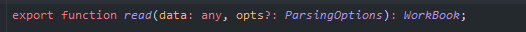

### 介绍
sheetjs是一款非常方便的只需要纯JavaScript就可以实现读取和导出Excel的js类库  
github地址：`https://github.com/sheetjs/sheetjs`

### 读取excel
表格内容如下  




读取excel主要是通过XLSX.read方法来实现，返回一个叫WorkBook的对象
配置对象ParsingOptions中重要的一个参数就是type了，它决定了读取的方式  


直接上代码
```javascript
import * as XLSX from 'xlsx';
;(function (doc) {
    function readExcel(e) {
        return new Promise((resolve) => {
            const files = e.target.files;
            const f = files[0];
            const reader = new FileReader();
            reader.onload = function (e) {
                const data = new Uint8Array(e.target.result);
                const workbook = XLSX.read(data, {type: 'array'});
                resolve(workbook);
            };
            reader.readAsArrayBuffer(f);
        })
    }
    doc.querySelector('#file_input').addEventListener('change', function (e) {
        readExcel(e).then(res => {
            console.log(res);
        })
    })
})(document)


```
我们打印workbook看一下


