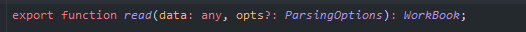
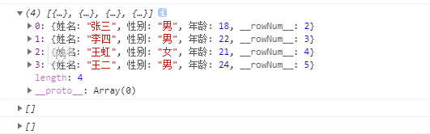
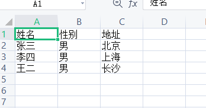

## 介绍
sheetjs是一款非常方便的只需要纯JavaScript就可以实现读取和导出Excel的js类库  
github地址：`https://github.com/sheetjs/sheetjs`

## 读取excel
表格内容如下  

  

读取excel主要是通过XLSX.read方法来实现，返回一个叫WorkBook的对象



配置对象ParsingOptions中重要的一个参数就是type了，它决定了读取的方式  


直接上代码
```javascript
import * as XLSX from 'xlsx';
;(function (doc) {
    function readExcel(e) {
        return new Promise((resolve) => {
            const files = e.target.files;
            const f = files[0];
            const reader = new FileReader();
            reader.onload = function (e) {
                const data = new Uint8Array(e.target.result);
                const workbook = XLSX.read(data, {type: 'array'});
                resolve(workbook);
            };
            reader.readAsArrayBuffer(f);
        })
    }
    doc.querySelector('#file_input').addEventListener('change', function (e) {
        readExcel(e).then(res => {
            console.log(res);
        })
    })
})(document)


```
我们打印workbook看一下

### 将表格内容转换成我们想要的数据格式
对于数据的转化，插件就已经集成了工具类XLSX.utils，常用的几个方法：  
```javascript
XLSX.utils.sheet_to_txt // 生成纯文本格式
XLSX.utils.sheet_to_html // 生成HTML格式
XLSX.utils.sheet_to_json // 输出JSON格式
XLSX.utils.sheet_to_csv // 生成CSV格式
```
使用方式如下：
```javascript
const sheets = workbook.Sheets;
for (const key in sheets) {
    if (sheets.hasOwnProperty(key)) {
        console.log(XLSX.utils.sheet_to_json(sheets[key], {range: "A2:C6"})); // 指定转换的单元格范围
    }
}
```
打印结果如下：  

## 将数据导出为excel
官方提供的工具类函数可以将多种数据转换成sheet，主要有：  
```javascript
aoa_to_sheet // 将一个二维数组转换成sheet
table_to_sheet // 将一个table转换成sheet
json_to_sheet // 将一个由对象组成的数组转换成sheet
```
下面以json_to_sheet为例：  
1. 先把数据转为sheet
```javascript
function generateSheet() {
    const info_json = [
        {'姓名': '张三', '性别': '男', '地址': '北京'},
        {'姓名': '李四', '性别': '男', '地址': '上海'},
        {'姓名': '王二', '性别': '男', '地址': '长沙'},
    ]
    const sheet = XLSX.utils.json_to_sheet(info_json);
    return sheet;
}
```
2. XLSX.writeFile 方法将文件下载到本地
```javascript
 function download(name) {
    const sheetName = name || 'sheet1';
    const workbook = {
        SheetNames: [sheetName],
        Sheets: {}
    };
    workbook.Sheets[sheetName] = generateSheet();
    XLSX.writeFile(workbook, 'test.xlsx');
}
```
3. 点击按钮触发下载操作
```javascript
doc.querySelector('#download').addEventListener('click', function () {
    download()
})
```
导出的内容：  
  
***
以上就是对sheetjs的简单使用，更多操作可以访问[sheetjs](https://github.com/SheetJS/sheetjs)
